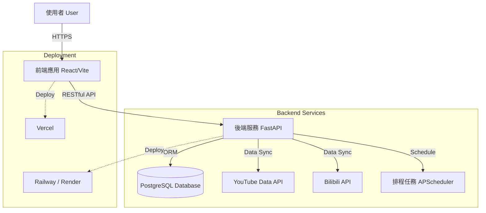

線上預覽 (Live Demo): https://shuttlecock-wisdom.vercel.app/

# 🏸 Badminton Wisdom | 羽球智慧平台

**Badminton Wisdom** 是集合了Youtube和B站的羽球拍評測影片的網頁合輯。

> 🚧 **Note**: 本儲存庫為專案的公開說明文件 (Public Documentation)，實際的原始碼 (Source Code) 託管於私有的 Backend 與 Frontend 儲存庫中。

---

## 🏗️ 系統架構 (System Architecture)

本專案採用前後端分離 (Headless) 架構，確保系統的擴充性與維護性。

---

## 🛠️ 技術堆疊 (Tech Stack)

### 🖥️ 前端 (Frontend) - `shuttlecock-wisdom`
現代化、響應式的單頁應用程式 (SPA)，注重使用者體驗與數據視覺化。

*   **核心框架**: [React 18](https://react.dev/), [TypeScript](https://www.typescriptlang.org/), [Vite](https://vitejs.dev/)
*   **UI 組件庫**: [shadcn/ui](https://ui.shadcn.com/), [Tailwind CSS](https://tailwindcss.com/)
*   **HTTP 客戶端**: Axios
*   **開發工具**: ESLint, Biome/Prettier

### ⚙️ 後端 (Backend) - `Badminton-Backend`
高效能、非同步的 RESTful API 服務，負責複雜的數據處理與外部串接。

*   **核心框架**: [Python 3.11+](https://www.python.org/), [FastAPI](https://fastapi.tiangolo.com/)
*   **資料庫與 ORM**: [PostgreSQL](https://www.postgresql.org/), [SQLAlchemy](https://www.sqlalchemy.org/), [Alembic](https://alembic.sqlalchemy.org/) (資料庫遷移)
*   **數據驗證**: [Pydantic](https://docs.pydantic.dev/)
*   **外部 API 整合**: 
    *   `google-api-python-client` (YouTube Data API)
    *   `bilibili-api-python` (Bilibili API)

---

## ✨ 核心功能 (Key Features)

### 1. 🏸 裝備數據庫 (Equipment Database)
建立了一個完整的羽球拍與裝備資料庫，包含規格參數（平衡點、中桿軟硬度、重量等）。
*   **特色**: 支援詳細的篩選與比較功能，幫助球友找到最適合的裝備。
*   <!-- 建議圖片: 裝備列表頁面或詳細規格比較圖 -->
    

### 2. 📺 球拍測評影片聚合 (Video Aggregation)
自動從 YouTube 與 Bilibili 抓取最新的羽球賽事精華與教學影片。
*   **自動化**: 透過後端排程器 (Cron Jobs) 定期同步最新內容。
*   **分類**: 依據廠牌，型號區分。
*   <!-- 建議圖片: 影片列表或播放介面 -->
    

---

## 🚀 部署 (Deployment)

*   **Frontend**: 自動化部署於 **Vercel**，支援 CI/CD，每次 Push 自動建置。
*   **Backend**: 容器化部署於  **Render**，確保高可用性與自動擴展。
*   **Database**: 託管於雲端 Supabase 服務。
*   **Optimization**: 使用 **UptimeRobot** 與 **GitHub Actions** 定時呼叫 Render 後端服務，防止實例進入休眠模式，顯著優化首屏加載速度 (Cold Start)。

---

## 📞 聯絡與反饋 (Contact)

如果您對這個專案有興趣，或有任何建議，歡迎透過以下方式聯繫：

*   Email: [west7418@gmail.com]
*   GitHub: [[Your GitHub Profile](https://github.com/CiaShangLin)]
